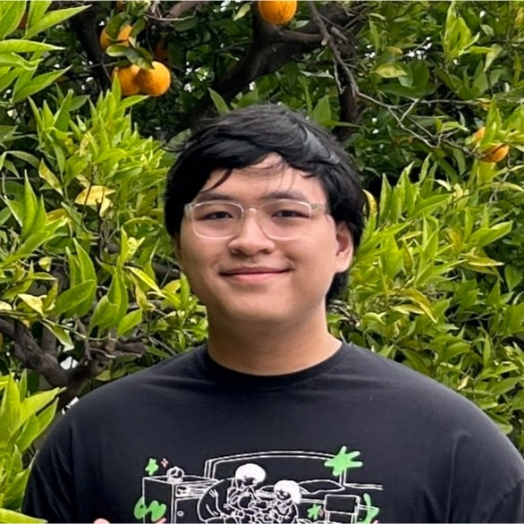

::: {.home-hero}
::: {.home-copy}
Binh Vu (pronounced like the ~bad~ search engine). Senior majoring in Economics and Mathematics-Statistics at [Lawrence University](https://www.lawrence.edu/), soon to be an Economics PhD student at [Florida State University](https://www.fsu.edu/).

[About](about.qmd) has a little more about me, and [Things](things.qmd) reveal my impeccable weltanschauung.

The website currently contains vignettes of: a [capstone](projects/index.qmd), [Advanced Data Computing projects](learning/datacomp/index.qmd), [Regression Analysis](learning/regress/index.qmd), and [Numerical Analysis](learning/numana/index.qmd).

For grading convenience, the Stat 405 projects are [here](learning/datacomp/index.qmd), and the source code for the website can be accessed [here](https://github.com/vub23/vub23.github.io).

Please feel free to reach out!

::: {.contact-links}
[ Email](mailto:2464.vu@gmail.com)
[ LinkedIn](https://www.linkedin.com/in/vub23/)
[ GitHub](https://www.github.com/vub23/)
:::
:::

::: {.home-photo-wrap}

:::
:::
